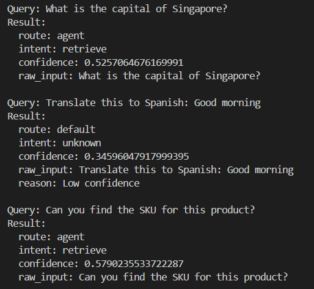
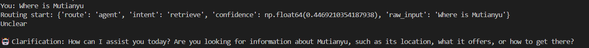

# RAG system with Ai Agents
This project implements a **RAG AI agent system** using transformers, a routing classifier, and a set of modular tools like document retrieval and email drafting.

**Core Architecture**
1. Router Agent: Decides how to handle the query.
2. Main Agent: Handles multi-step reasoning with tools.
3. Tools: Vector DB (RAG)....
4. Memory: Short-term state tracking.

## Workflow Overview

```bash
User Query
   ↓
Routing Agent
 ├──> Direct Tool Call (or normal QnA)
 └──> Main Agent
         ↓
      Call Tools -> Pass Output to LLM
                        └──> Final Answer (Clean up Answer + Suggestion)
                                    └──> Output to User
```

 - Models Used:
    1. Qwen/Qwen3-Embedding-0.6B (Embedding)
    2. all-MiniLM-L6-v2 (Routing Agent)
    3. microsoft/Phi-3-mini-4k-instruct (ReAct Agent)

# Getting Started
1. Install the required Libraries
2. Setup Docker + VectorDB
3. Embedded Documents into the database
4. Use `agent/main.py` for the RAG Agent

## Embedding + Storing of Data + Database
Download from https://www.postgresql.org/download/

Create Docker container for Database and PgAdmin.
```bash
docker pull pgvector/pgvector:pg16

docker volume create pgvector-data

docker run --name pgvector-container -e POSTGRES_PASSWORD=password -e POSTGRES_DB=vectordb -p 5432:5432 -v pgvector-data:/var/lib/postgresql/data -d pgvector/pgvector:pg16
```

PgAdmin
```bash
docker pull dpage/pgadmin4

docker run --name pgadmin-container -p 5050:80 -e PGADMIN_DEFAULT_EMAIL=test@user.com -e PGADMIN_DEFAULT_PASSWORD=password -d dpage/pgadmin4
```
### download pgvector 
-- In psql or pgAdmin:
CREATE EXTENSION IF NOT EXISTS vector;

### Creating the Table
```bash
CREATE TABLE documents (
    id UUID PRIMARY KEY,
    chunk TEXT NOT NULL,
    embedding VECTOR(1024), -- Adjust based on your embedding model dimension
    document_name TEXT NOT NULL,
    permissions TEXT[] DEFAULT ARRAY['default'],
    chunk_index INT NOT NULL,
    created_at TIMESTAMP NOT NULL DEFAULT CURRENT_TIMESTAMP,
    file_hash TEXT NOT NULL,
    metadata JSONB DEFAULT '{}'
);
```

## Embedding.py Script
1. File Upload
2. Check file data type -> Sort
3. Tokenizer + Chunking
4. Embedding (Qwen 0.6)
5. Insert into DB

Can consider using a different Tokenizer and Embedding. Currently we are using 
    EMBEDDING_MODEL_NAME = "Qwen/Qwen3-Embedding-0.6B"
    tokenizer = AutoTokenizer.from_pretrained("Qwen/Qwen3-Embedding-0.6B")

For Security:
We have create a metadata for each embedding, which includes the permission type. All embedding will be insert into 1 database. Which can be improve to have mutliple database for each role/group. For example, R&D Table, Finance Table.... But this will be more complex, requires more data + storage, and may cause Data Duplication.

## Routing Agent
Decides which agent/tool to use for a query, improving efficiency and scalability.
Place at entry point of system to route queries:
 * ReAct Agent (Complex Tasking).
 * Vector DB (Simple Retrieval),
 * Other Tools (APIs, Translation, Email...)

### Routing_agent.py
Using "all-MiniLM-L6-v2", we will train some sample data. Example: "("What is the product with ", "agent:retrieve"),
    ("Translate this to French: Hello", "tool:translator"),"
Trains a logistic regression model to predict the label based on the sentence embedding.
Based on the training data, we will use it to do our queries. It will make a predicition on the user queries and splits the predicted label by ":" into "route" and "intent".

## Main Agent (react_agent.py)
Based on the intent, the correct tool is retrieved from tool_list.py. For example, "tool": "retrieve", will invoke the vector database (retrieval_tool.py). Once tool execution is done, It will then pass the observation (result) into a prompt template for the LLM to process. After answering, the agent sends a second prompt asking the LLM to suggest 3 follow-up actions or questions the user might be interested in.

### ReAct Agent (Reason + Action Agent) [Failed]
----------
Handles sequential reasoning, tool execution, and state management in a unified loop. This will be the default agent for most tasks. 
Equip with tools (Vector DB, apis, translation....) and Memory (Short-term state tracking)

Example: 
Thought: Upon receiving the user query, the agent reasons about the next action to take
Action: the agent decides on an action and executes it (e.g., tool use)
Observation: the agent observes the feedback from the action

## Challenges Faced
### Issues face with ReAct
----------
LLM Hallucination - LLM creating fake documments and random tools, not calling the right tools.
Looping - Each loop the responses from LLM gets further and further away from task goals. Which also results in halluincation.


### Another issue with "Token indices sequence length is longer than the specified maximum sequence length for this model (14739 > 2048)"
----------
When calling LLM calls the retrieval tool, the retrieval tool will pass the whole output to the LLM. Which might exceed the maximum input length. With the `clean_observations` function, it helps to process and simplify the raw output you get from the retrieval tool before sending it to the LLM.  With `max_length=2000` it will pass only the first 2000 characters to the LLM, preventing this issue with maximum input length. To improve on this, can consider doing a summarization or truncation. However, with this steps it will affect the integrity of the data.

### Essential Tools (tool_list.py):
* Vector DB: Retrieval from vector embeddings.

## Memory:
* Short-term: Track state within ReAct Loop.
* Long-Term: Cache past interactions for user context.


## Retrieve.py (Simple Retrieval tool)
1. Get connection from vector DB
2. Search from DB using inner product/ dot product. Set as 1.4 for similarity score.
3. Sort by chunk then by grouping chunks by file_hash or document_name.

```bash
if confidence < 0.4:
        return {
            "route": "default",
            "intent": "unknown",
            "confidence": confidence,
            "raw_input": query,
            "reason": "Low confidence"
        }
```
To help with avoid issue with unkown or weird queries , i have implemented a confidence threshold check. It will help the system to avoid making uncertain predictions by falling back to a default response

### Issues with GPU and low memory space
Currently facing issue with low memory space, thus we will off load it and force it to use "cpu".  Together with Lazy Loading of the Embedder and Explicit Model Unloading. Hopefully this will reduce the memory space issue.

## Example (Routing_Agent.py): 


## Clarification

